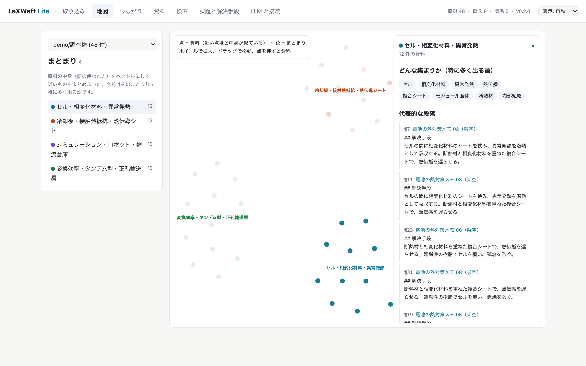
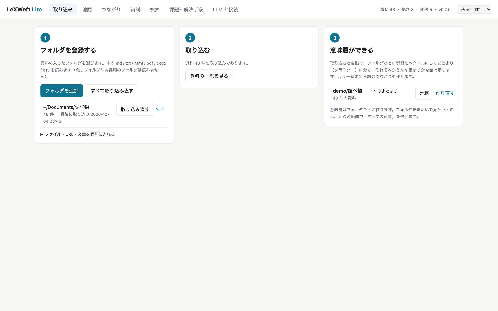
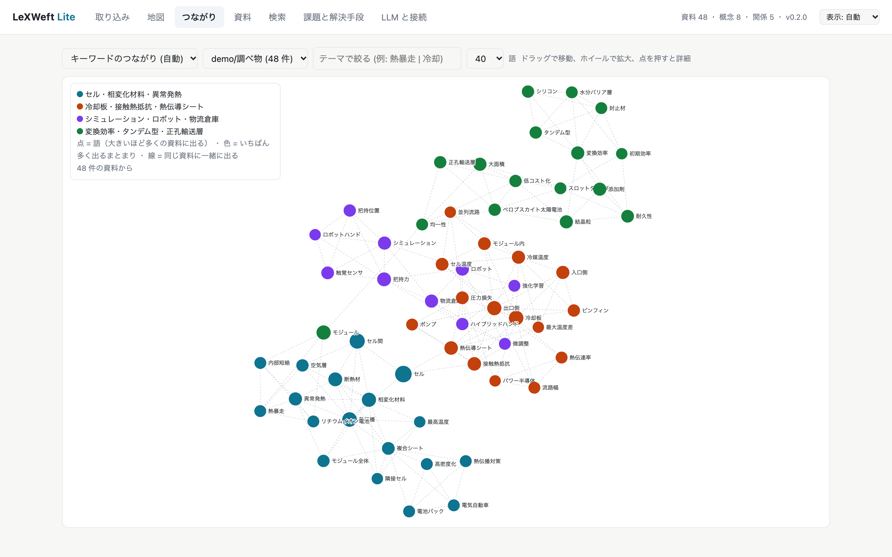
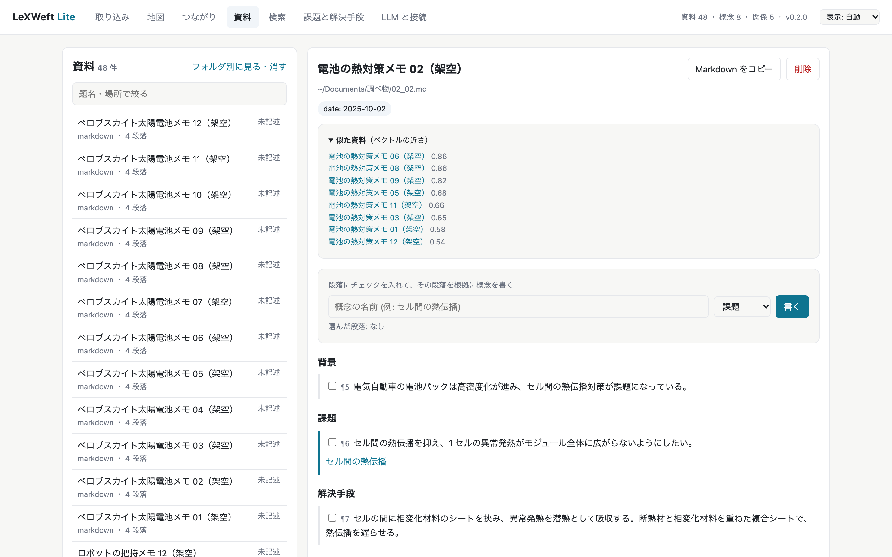
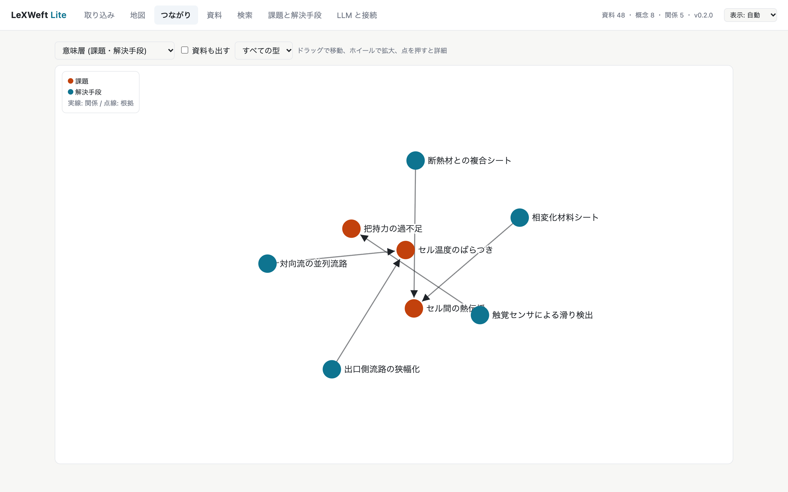
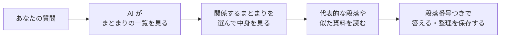
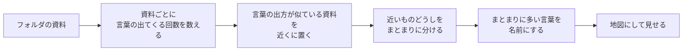

# LeXWeft Lite

**フォルダに入れた資料を、中身ごとに自動で整理して「地図」にしてくれるアプリです。**



*点の 1 つ 1 つが資料です。中身が似ている資料ほど近くに集まり、集まりごとに色と名前が付きます。（画面の資料は説明用の架空のものです）*

▶ **操作の様子は [プレイ動画（約 2 分）](marketing/LeXWeftLite_プレイ動画.mp4) で見られます。** フォルダの登録から、地図・つながり・意味層でたどる検索・Claude とのつなぎ方まで、字幕つきで紹介しています。

---

## これは何？

たとえば、図書館の司書さんを思い浮かべてください。

本棚にばらばらに置かれた本を、司書さんが 1 冊ずつ中身を読んで、**似た内容の本を同じ棚にまとめ、棚に「電池の熱対策」「ロボットの手」のような名札を付けてくれる**。LeXWeft Lite がやるのは、これのパソコン版です。

- あなたは、資料の入ったフォルダを選ぶだけ
- アプリが中身を読んで、似た資料どうしをまとまりに分ける
- それぞれのまとまりに「どんな集まりか」が分かる名前を付ける
- 結果を地図や図で見せてくれる
- その整理結果（意味層）を、AI の Claude にも読ませられる

## どんなときに便利？

- **調べ物のメモや報告書がたまって、どこに何があるか分からなくなったとき**
  フォルダ名やファイル名を見ても中身は分かりません。地図を見れば、どんなテーマの資料がどれくらいあるかが一目で分かります。
- **「前にも似たことを調べた気がする」とき**
  資料を開くと、中身が似ている資料が並びます。言い回しが違っていても見つかります。
- **生成 AI に手伝ってほしいけれど、資料を丸ごとネットに上げたくないとき**
  資料はあなたの PC の中に置いたまま、必要な部分だけを AI（Claude）に読ませられます。

## 何ができる？

### 1. フォルダを登録して取り込む



「フォルダを追加」で資料の入ったフォルダを選ぶと、中のファイルを読み込みます。読み込む前に「何件あるか」を見せてくれるので、間違ったフォルダを選んでも安心です。

読めるファイル: **Markdown（.md）、テキスト（.txt）、Web ページ（.html）、PDF、Word（.docx）、表（.csv）**

### 2. 地図で全体を見る

いちばん上の画像がこれです。中身が似ている資料は近くに、違う資料は遠くに置かれます。色のついた集まりを押すと、

- その集まりに**特によく出てくる言葉**（＝何の集まりか）
- その集まりを**代表する文章**
- 集まりの**真ん中に近い資料**

が出てきます。

### 3. 言葉のつながりを見る



資料によく出てくる言葉を、**同じ資料に一緒に出てくるものどうしで線で結んだ図**です。「熱暴走」と「相変化材料」がよく一緒に出てくる、といった関係が見えます。調べたいテーマの言葉で絞り込むこともできます。

### 4. 資料を開く・似た資料を見つける



資料を開くと、本文が段落ごとに番号（¶）付きで表示され、上に**中身が似ている資料**が並びます。

### 5. Claude とつないで、もっと深く調べる（使わなくても大丈夫）



AI の **Claude Desktop** とつなぐと、Claude が LeXWeft Lite の資料を読めるようになります。たとえば、こう頼めます。

> LeXWeft Lite のまとまり「セル・相変化材料・異常発熱」の資料を読んで、課題と解決手段を根拠の段落つきで書いて。

Claude は「どの資料のどの段落に書いてあったか」を番号で残しながら、**課題（困っていること）** と **解決手段（その解き方）** を整理してくれます。答えが本当かどうか、元の段落に戻って確かめられます。

## 意味層を作って AI に読ませると、何がいいの？

LeXWeft Lite が作る「資料のまとまり・その名前・言葉のつながり・似た資料」をまとめて、**意味層**と呼んでいます。いわば**資料の束につける「目次」と「索引」と「地図」**です。

AI に資料を読ませるとき、資料をそのまま渡すより、この意味層を通したほうがうまくいきます。理由は 7 つあります。

### 1. 資料が多くても扱える

AI が一度に読める文章の量には上限があります。資料が数百件あると、全部を一度に渡すことはできません。

意味層があれば、AI はまず**地図（まとまりの一覧）を見て、関係のあるまとまりだけを開き、必要な段落だけを読む**、という順番で進められます。人が分厚い本を読むときに、まず目次を見るのと同じです。

### 2. 答えの根拠を確かめられる

AI はときどき、もっともらしい間違いを答えます。LeXWeft Lite では、資料の段落ごとに番号（¶）が付いているので、AI に「根拠の段落番号つきで答えて」と頼めます。**答えを見たら、その番号の段落に戻って本当に書いてあるかを確かめられます。**

### 3. 言い回しが違っても見つけやすい

同じことでも、資料によって「熱暴走」「延焼」「熱の連鎖」のように書き方が違います。キーワード検索だけでは取りこぼします。

意味層には「この言葉とよく一緒に出る言葉」や「中身が似ている資料」の情報があるので、AI はそれを手がかりに**言い換えを考えて探し直せます**。

### 4. 資料の束全体について質問できる

1 つの資料の中身だけでなく、

- 「このフォルダには、どんなテーマの資料がある？」
- 「資料が多いテーマと、少ないテーマは？」
- 「このテーマで、まだ調べていない観点は？」

のような、**資料の束全体についての質問**ができます。まとまりの一覧が、全体を見渡す手がかりになるからです。

### 5. 調べた結果が残り、次に使える

AI に書かせた「課題」と「解決手段」は、根拠の段落といっしょに LeXWeft Lite に保存されます。**次に調べるときは、ゼロから読み直さずに、前回の整理の続きから始められます。** 画面からも見たり直したりできます。

### 6. 資料を丸ごと AI に渡さなくてよい

AI に送られるのは、AI がその質問のために LeXWeft Lite から取り出した部分（まとまりの名前、資料の題名、開いた段落など）だけです。資料を全部アップロードする必要はありません。（送った部分は AI のサービスに届くので、秘密の資料は勤め先の決まりを確かめてください）

### 7. 関係があるのに読まれない資料を減らす

Claude には、意味層をたどるための道具を用意しています。

1. **地図を見る**（`lw_map`）: どんなまとまりがあるか
2. **道案内**（`lw_route`）: 質問から、関係するまとまり → 資料 → 段落へ。言葉の意味の近さと、文字の一致の両方で探します
3. **近くをたどる**（`lw_expand`）: 読んだ資料と似た資料・同じまとまりの資料へ
4. **読み残しの確認**（`lw_unread`）: 関係が強いのに、まだ開いていない資料を理由つきで示します

Claude は答える前に読み残しを確かめるので、「言い方が違うせいで読まれなかった関連資料」が減ります。使い方は、チャットで次のように頼むだけです。

> LeXWeft Lite で「電池の熱暴走を防ぐ方法」を調べて。関係する資料を読み残しがないように確かめてから、根拠の段落番号をつけて答えて。

画面の「検索」タブの「意味層でたどる」でも、同じ道案内と読み残しを見られます。

**どのくらい届くか（架空の資料 60 件での確かめ）**

4 つの話題について、同じ話題の資料 15 件を、わざと言い方を変えて書きました（例: 熱暴走 / 延焼 / 類焼 / 熱連鎖 / 発火の連鎖）。1 つの言い方で質問したとき、同じ話題の資料に何件届くかを比べました。

| 探し方 | 届いた資料（15 件中） |
|---|---|
| 文字の一致だけ | 4〜10 件 |
| 意味層の道案内 1 回（上位 8 件） | 8 件（8 件とも関係あり） |
| 道案内 ＋ 読み残しの確認 1 回 | 10〜15 件 |
| 道案内 ＋ 近くをたどる 1 回 | 15 件 |

道案内の 8 件は、どの話題でもすべて関係のある資料でした。読み残しの確認と近くをたどる方法では、関係のない資料も少し混ざります（多いときで 18 件中 8 件。たとえば「電池」という言葉で、太陽電池の資料が候補に入る）。そのため読み残しには、確かめるための段落と理由を付けて返し、Claude が開くかどうかを判断します。また、これは言い方の違いを人工的に作った資料での結果です。実際の資料では数字が下がると考えてください。確かめ方と全部の結果は [docs/eval/navigation.md](docs/eval/navigation.md) にあり、`scripts/eval_navigation.py` で同じ確かめを繰り返せます。

### 資料をそのまま渡すときとの違い

| | 資料をそのまま AI に渡す | 意味層を通して AI に読ませる |
|---|---|---|
| 資料が多いとき | 一度に読める量を超えると渡せない | 地図 → まとまり → 段落の順に、必要な分だけ読む |
| 答えの確かめ方 | どこに書いてあったか分かりにくい | 段落番号で元の文章に戻れる |
| 言い回しの違い | 書き方が違うと見落とす | 似た資料や言葉のつながりから言い換えを探す |
| 全体についての質問 | 全部読ませないと答えられない | まとまりの一覧から答えられる |
| 次に調べるとき | 毎回読み直し | 前回の整理が残っている |
| 送る量 | 資料を丸ごと | 取り出した部分だけ |

### AI が意味層を読む流れ



たとえば、こんなふうに頼めます。

> LeXWeft Lite で、このフォルダにどんなテーマの資料があるか、まとまりごとに 1 行で教えて。

> 「セル間の熱伝播」を解決する方法を、根拠の段落番号つきで一覧にして。言い換えも使って探して。

> まとまり「冷却板・接触熱抵抗・熱伝導シート」の資料から、課題と解決手段を整理して保存して。

## しくみ（ざっくり）

難しい計算をしていますが、考え方はシンプルです。



1. 資料ごとに、どんな言葉が何回出てくるかを数えます。
2. 「同じような言葉が同じような割合で出てくる資料」は内容が似ている、と考えて近くに置きます。この「資料の特徴を数字の並びで表したもの」を**ベクトル**と呼びます。
3. 近くに集まった資料をまとめて、**まとまり（クラスター）** にします。
4. そのまとまりに特によく出て、ほかのまとまりにはあまり出ない言葉を、まとまりの名前にします。

この「資料・まとまり・言葉のつながり」をまとめて、このアプリでは**意味層**と呼んでいます。資料を足すと、意味層も自動で作り直されます。意味層はフォルダごとに作るので、テーマの違う資料が混ざりません。

## 資料はどこに保存されるの？安全？

| 何が | どこに・どうなる |
|---|---|
| 取り込んだ資料と意味層 | あなたの PC の中（ホームフォルダの `LeXWeftLite`）にだけ保存します |
| 元のファイル | 読むだけです。書き換えたり消したりしません |
| アプリからインターネットへの送信 | しません。画面との通信も PC の中だけです |
| Claude に読ませた部分 | Claude（Anthropic 社）に送られます。会社の秘密の資料は、勤め先の決まりを確かめてから使ってください |

アプリ自身は AI を呼び出さないので、**API キー（AI サービスの利用料を払うための鍵）は要りません**。

## 入れ方

配布用の ZIP を受け取った方は、ZIP の中の `START_HERE.html` を開くと、画面つきの手順があります。利用条件は `TERMS.txt` にあります。

### Mac

1. ZIP を開いて（ダブルクリック）、できた `LeXWeftLite` フォルダを「書類」フォルダに移します。
2. **ターミナル**を開きます（⌘ + スペースを押して「ターミナル」と入力し、Enter）。
3. ターミナルに `bash` と打って半角スペースを 1 つ入れ、フォルダの中の `install.sh` をターミナルの画面にドラッグして、Enter を押します。
4. 数分待ちます。必要なものを自動でダウンロードして入れます。
5. 最後に「Claude Desktop に登録しますか」と聞かれます。Claude を使うなら `y`、使わないなら Enter だけ押します。
6. Launchpad か Spotlight（⌘ + スペース）で **「LeXWeft Lite」** を開きます。

> Mac にアプリを作るには Apple の開発ツールが必要です。入っていないときは、代わりにフォルダの中の「LeXWeft Lite.command」をダブルクリックすると、ブラウザで開きます。アプリにしたいときは、ターミナルで `xcode-select --install` を実行してから、手順 3 をもう一度行ってください。

### Windows

1. ZIP を右クリックして「すべて展開」を選び、できたフォルダを「ドキュメント」に移します。
2. そのフォルダを開き、上のアドレス欄に `powershell` と入力して Enter を押します。
3. 出てきた画面に、次を貼り付けて Enter を押します。

   ```powershell
   powershell -ExecutionPolicy Bypass -File .\install.ps1
   ```

4. 数分待ち、最後の質問に答えます（Mac の手順 5 と同じ）。
5. フォルダにできた **「LeXWeft Lite.bat」** をダブルクリックすると、ブラウザで開きます。

### Claude とつながったか確かめる

セットアップの最後に `y` を押した場合は、次の 2 つを行います。

1. **Claude Desktop をいったん終了して、開き直す。** Mac は Claude Desktop の画面で ⌘Q、Windows は画面右下のタスクトレイの Claude アイコンを右クリックして「終了」。ウインドウの × で閉じるだけでは終了しません。
2. **新しいチャットで、次のように聞く。**

   > LeXWeft Lite に入っている資料は何件？

   件数が返ってくれば、つながっています。途中で「LeXWeft Lite を使ってよいか」と聞かれたら、「許可」を押してください。

## 使い方（3 ステップ）

1. **「取り込み」タブで「フォルダを追加」** を押し、資料の入ったフォルダを選ぶ
2. 件数を確かめて **「取り込む」** を押す（終わると意味層が自動でできます）
3. **「地図」タブ** で全体を見る。気になるまとまりを押して中身を確かめる

あとは必要に応じて、「つながり」で言葉の関係を見たり、「資料」で似た資料をたどったり、「検索」で言葉を探したりします。資料を足したら「取り込み直す」を押すと、新しいファイルだけを読み込みます。

**コツ:** ホームフォルダ全体のような大きなフォルダより、**テーマごとのフォルダ**（例:「電池の熱対策」「ロボット調査」）を登録したほうが、まとまりがはっきりします。

## よくある質問

**Q. ネットにつながっていないと使えませんか？**
入れるときだけネットが必要です。入れたあとは、Claude とつなぐ場合を除いて、ネットなしで使えます。

**Q. 資料はどれくらいの数まで入れられますか？**
これまでに、約 9,000 件の取り込みと、約 800 件での意味層づくりを確かめています。資料が多いほど、意味層を作るのに時間がかかります（目安: 800 件で 30 秒ほど）。

**Q. まとまりの名前がしっくりきません。**
名前は「そのまとまりによく出る言葉」を機械的に並べたものです。テーマごとにフォルダを分けて登録すると、名前が分かりやすくなります。

**Q. 間違ったフォルダを取り込んでしまいました。**
「資料」タブの「フォルダ別に見る・消す」から、フォルダごとにまとめて消せます。元のファイルは消えません。

**Q. 画面が白くてまぶしいです。**
画面右上の「表示」で、ダーク（黒い背景）に切り替えられます。

## 困ったとき

| こんなとき | こうしてください |
|---|---|
| Claude に「LeXWeft Lite に入っている資料は何件？」と聞いても、LeXWeft Lite のことが分からないと言われる | Claude Desktop を完全に終了して開き直す（⌘Q、Windows はタスクトレイから終了）。それでもだめなら、入れ方の手順 3 をもう一度行い、最後に `y` を押す |
| 地図が「作っています」のまま | 資料が多いと数分かかります。終わると自動で表示されます |
| PDF の本文が出ない | スキャンした画像の PDF は文字を読めません。文字を選択できる PDF を使ってください |
| セットアップが途中で止まる | ネットにつながっているか確かめて、もう一度実行してください |

---

## くわしい人向け

### コマンド

`LeXWeftLite/.venv/bin/lexweft`（Windows は `.venv\Scripts\lexweft.exe`）で使えます。

| コマンド | 内容 |
|---|---|
| `lexweft serve [--port N]` | 画面を開く（番号を指定しなければ 8765 から空いている番号） |
| `lexweft add <ファイル/フォルダ/URL>` | 取り込む |
| `lexweft status` | 件数を見る |
| `lexweft export [--out DIR]` | 資料ごとの Markdown と、課題と解決手段の一覧（`layer.md`）を書き出す |
| `lexweft prune` | 隠しフォルダ・開発用のフォルダ・ライセンス文など、取り込まない決まりに当たる資料を消す（元のファイルは消さない） |
| `lexweft mcp-config [--write]` | Claude Desktop に登録する設定を表示する（`--write` で書き込む。元の設定は `.bak` に残る） |
| `lexweft mcp` | MCP サーバーとして動く（Claude Desktop が呼ぶ） |

### 保存先

既定は `~/LeXWeftLite`。環境変数 `LEXWEFT_HOME` で変えられます。

| 場所 | 中身 |
|---|---|
| `lexweft.sqlite3` | 資料・段落・意味層 |
| `markdown/` | 資料ごとの Markdown（書誌と段落番号 `[¶n]` 付き。LLM に渡しやすい形） |
| `files/` | 画面から 1 つずつ入れたファイルの写し |

アンインストールは、アプリのフォルダと `~/LeXWeftLite` を消し、Mac アプリ（`~/Applications/LeXWeft Lite.app`）を消して、Claude Desktop の設定から `lexweft-lite` を外します。

### 計算の中身

| 段階 | 方法 |
|---|---|
| 言葉の切り出し | 漢字・カタカナの連なりと英単語を数える（日本語の資料では英語は略語だけ）。コード片や HTML のタグは除く |
| 資料のベクトル | TF-IDF を LSA（切り詰めた特異値分解、最大 100 次元）で圧縮 |
| まとまり | k-means。まとまりの数はシルエット係数で選ぶ |
| まとまりの名前 | クラス単位の TF-IDF（そのまとまりに多く、ほかに少ない語） |
| 地図の座標 | t-SNE（資料が 3,000 件を超えるときは主成分分析） |
| 言葉のつながり | 同じ資料に一緒に出る割合（Jaccard 係数）で結ぶ |
| 検索（文字） | 全文検索（trigram）。言い換えを `\|` で並べると、それぞれの順位を RRF でまとめる |
| 意味層の道案内 | 段落と質問を資料と同じ LSA の空間に置き、コサインの近さと全文検索の順位を RRF でまとめる。まとまりの点は上位の資料の割合と中心との近さ |
| 読み残し | 質問への近さの順に並べ、開いた資料を除く。理由（意味の近さ・文字の一致・読んだ資料と同じまとまり）を添える |

### Claude（MCP）で使える道具

`lw_map`（意味層の地図）、`lw_route`（道案内）、`lw_expand`（近くをたどる）、`lw_unread`（読み残しの確認）、`lw_scopes`（範囲の一覧）、`lw_clusters` / `lw_cluster`（まとまり）、`lw_similar_documents`（似た資料）、`lw_keywords`（言葉のつながり）、`lw_search`（段落の検索）、`lw_read_document`（資料を読む）、`lw_write_concept` / `lw_relate`（課題と解決手段を書く・結ぶ）など。プロンプト `investigate`（意味層をたどって読み残しなく調べる）、`build_layer`、`build_layer_for_topic` も用意しています。

### 配布用 ZIP を作る（提供者向け）

```bash
./.venv/bin/python scripts/build_release.py --feedback-url https://... --deny-file <配布物に入れない語の一覧>
```

`dist/LeXWeftLite-<版>.zip` ができます。ZIP の中のフォルダ名は版によらず `LeXWeftLite` です。

### 権利と利用条件

このリポジトリのソースコードと資料の著作権は、提供者（LeXI/Vent）にあります。オープンソースのライセンスは付けていません。テスト版の利用条件は [TERMS.txt](TERMS.txt) をご覧ください。
